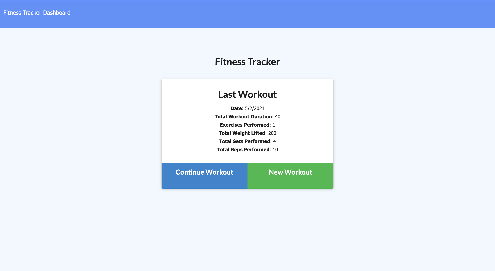
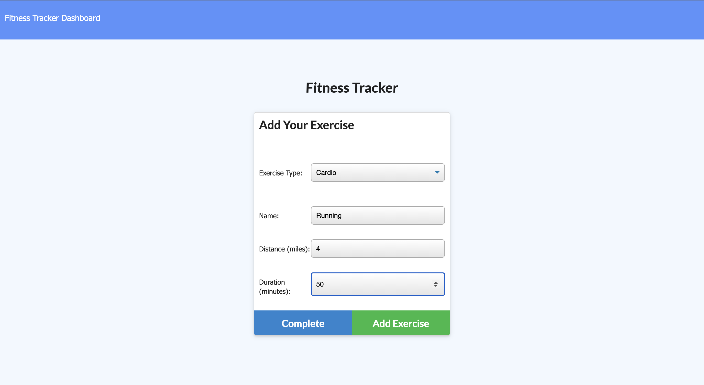
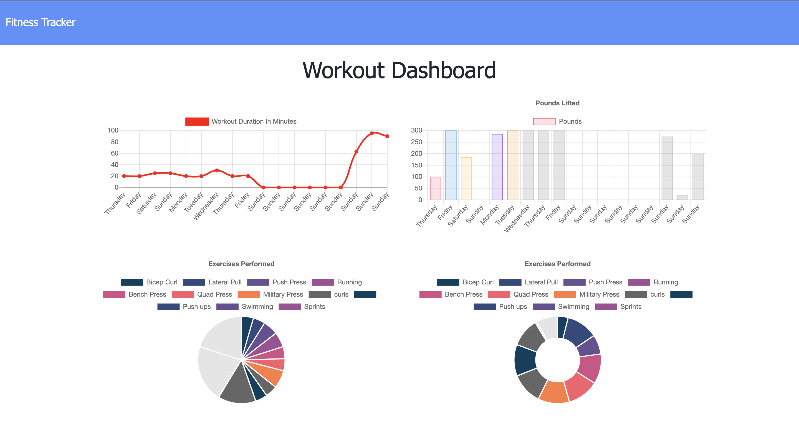

# Workout Tracker: Jenn Greiner

### Table of Contents:
* [Deployed Site](#deployed-site)
* [User Story](#user-story)
* [Description](#description)
* [Usage](#Usage)
* [Mock-Up](#Mock-Up)

## Deployed Site
[Production Link](https://ft-hw-17.herokuapp.com/)

## User Story
As a user, I want to be able to view create and track daily workouts. I want to be able to log multiple exercises in a workout on a given day. I should also be able to track the name, type, weight, sets, reps, and duration of exercise. If the exercise is a cardio exercise, I should be able to track my distance traveled.

## Description 
This application allows users to add exercises to existing workout plans, create new workout plans, and view the total duration and combined weight of multiple exercises from the past seven workouts on the `stats` page.

Click the link below for a video walkthrough.

**[Workout Tracker Video Walkthrough](https://drive.google.com/file/d/1MT_AeoHT0m_TMVxvRpjBg0SkLqMVOc3s/view?usp=sharing)**

## Usage
Open the [Workout Tracker](https://ft-hw-17.herokuapp.com/) in your browser. The data from your most recent workout will be displayed. Click Continue Workout to add new excercises to the most recent workout, or click New Workout to start a new workout. The AddYour Excercise page will appear, where you can select the type of workout, duration, distance weight, reps, and sets for the exercise. Click Add Exercise to continue adding additional exercises to your workout, or if you are done, click Complete. The data for your most recent workout will be updated. To view the stats for your last seven workouts, click Dashboard in the top left corner. 

## Mock-Up

The following image shows the Workout Tracker's appearance and functionality:

## Installation
This application will run in any web browser.

## Credits
* [MongoDB Atlas](https://www.mongodb.com/cloud/atlas/signup)
* [Robo 3T](https://robomongo.org/)
* [Insomnia](https://insomnia.rest/)
* [MongoDB documentation on the $addFields](https://docs.mongodb.com/manual/reference/operator/aggregation/addFields/)
* [MongoDB documentation on the $sum operator](https://docs.mongodb.com/manual/reference/operator/aggregation/sum/)
* [Mongoose documentation on aggregate functions](https://mongoosejs.com/docs/api.html#aggregate_Aggregate)

## License
* MIT License

      Copyright (c) 2021
      
      Permission is hereby granted, free of charge, to any person obtaining a copy
      of this software and associated documentation files (the "Software"), to deal
      in the Software without restriction, including without limitation the rights
      to use, copy, modify, merge, publish, distribute, sublicense, and/or sell
      copies of the Software, and to permit persons to whom the Software is
      furnished to do so, subject to the following conditions:
      
      The above copyright notice and this permission notice shall be included in all
      copies or substantial portions of the Software.
      
      THE SOFTWARE IS PROVIDED "AS IS", WITHOUT WARRANTY OF ANY KIND, EXPRESS OR
      IMPLIED, INCLUDING BUT NOT LIMITED TO THE WARRANTIES OF MERCHANTABILITY,
      FITNESS FOR A PARTICULAR PURPOSE AND NONINFRINGEMENT. IN NO EVENT SHALL THE
      AUTHORS OR COPYRIGHT HOLDERS BE LIABLE FOR ANY CLAIM, DAMAGES OR OTHER
      LIABILITY, WHETHER IN AN ACTION OF CONTRACT, TORT OR OTHERWISE, ARISING FROM,
      OUT OF OR IN CONNECTION WITH THE SOFTWARE OR THE USE OR OTHER DEALINGS IN THE
      SOFTWARE.

- - -